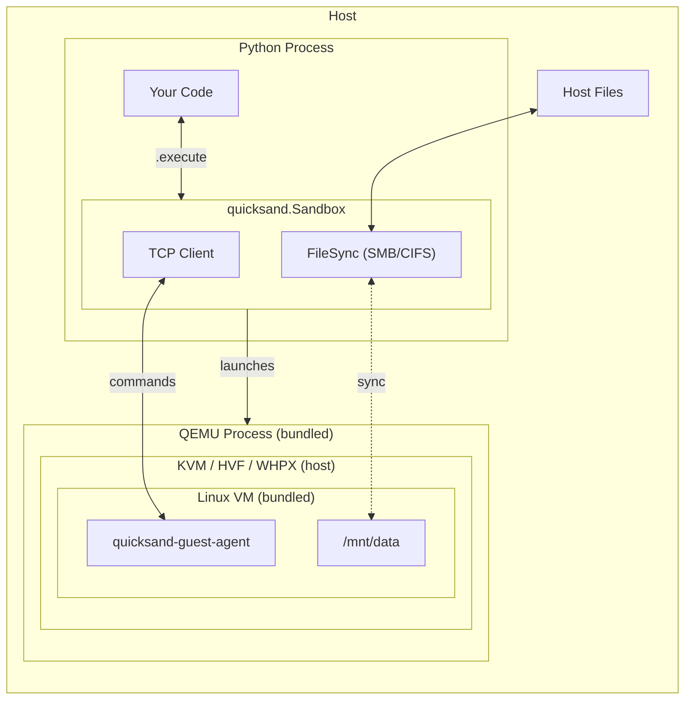

# Quicksand

Quicksand is a VM harness for AI agents that works on macOS, Linux, and Windows.

## Quick Start

**1. Install quicksand**

```bash
pip install 'quick-sandbox[qemu,ubuntu]'
```

**2. Run the sandbox in python**

```python
import asyncio
from quicksand import UbuntuSandbox

async def main():
    async with UbuntuSandbox() as sb:
        result = await sb.execute("echo 'Hello from the sandbox!'")
        print(result.stdout)

asyncio.run(main())
```

That's it. Docker? Don't need it. WSL2? Nope. Batteries? Included.

## Usage

```python
import asyncio
from quicksand import Sandbox, Mount, NetworkMode

async def main():
    async with Sandbox(
        image="ubuntu",
        mounts=[Mount("./workspace", "/mnt/workspace")],
        network_mode=NetworkMode.FULL,  # Full internet access
    ) as sb:
        await sb.execute("pip install requests")
        await sb.execute("python /mnt/workspace/script.py")
        print((await sb.execute("cat /tmp/output.txt")).stdout)
        await sb.save("./my-save")  # Save disk state, VM keeps running

asyncio.run(main())
```

For implementation details, see [Under the Hood](/under-the-hood/).

## How It Works



Each sandbox runs in a real virtual machine with hypervisor-level isolation:

| Platform | Accelerator | Machine | File Sharing | Performance |
|----------|-------------|---------|--------------|-------------|
| Linux x86_64 | KVM | q35 | SMB/CIFS | io_uring + IOThreads |
| Linux ARM64 | KVM | virt | SMB/CIFS | io_uring + IOThreads |
| macOS | HVF | q35/virt | SMB/CIFS | IOThreads |
| Windows | WHPX | q35 | SMB/CIFS | IOThreads |

Key components:
- **Bundled QEMU**: No system installation required
- **Guest agent**: Lightweight TCP server for command execution
- **Disposable overlays**: Base image unchanged, writes go to temp overlay
- **SMB/CIFS mounts**: Mount host directories into the VM
- **Platform optimizations**: io_uring (~50% lower disk latency), IOThreads

## Requirements

- Python 3.11+
- No system dependencies (QEMU is bundled)
- For custom images: Docker
