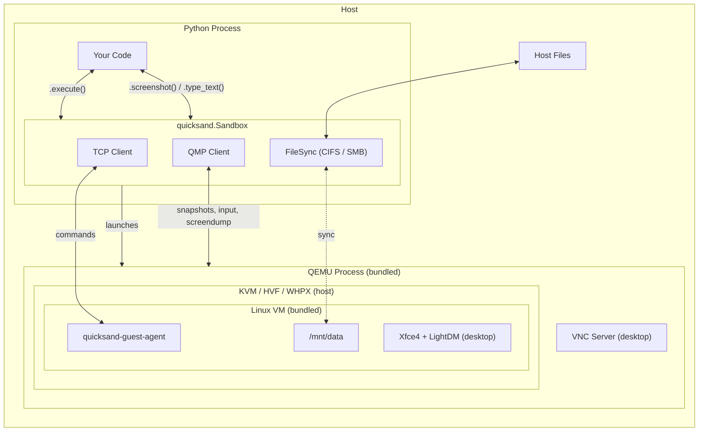

# Under the Hood

Quicksand is a VM harness for AI agents. It provides a Python API for running VMs that agents can interact with (executing commands, reading/writing files, browsing the web) with support for hot checkpointing, file sharing, GUI input, and cross-platform operation.



## Why This Approach?

LLMs are trained on data from real computers, including shell sessions, package managers, browsers, and GUIs. Agents work best when they get a full computer that matches what they already know how to operate. Quicksand gives each agent its own Linux VM. It is checkpointable, cross-platform, and has no system dependencies. Just `pip install`.

### What agents need from a sandbox

| Requirement | Why |
|-------------|-----|
| **Strong isolation** | Agents execute arbitrary code. Containers provide some isolation via namespaces, but they share the host kernel. A VM runs its own kernel behind a hypervisor — a stronger boundary. |
| **Save and restore** | Agents checkpoint before risky operations and roll back on failure. Ideally fast, reliable, and without root. |
| **Cross-platform** | Agents run on developer machines — macOS, Linux, Windows. A Linux-only solution limits adoption. |
| **No system dependencies** | Fewer moving parts means easier setup. Ideally no Docker daemon, no cloud API keys, no admin privileges. |
| **Full OS** | A complete Linux environment — `apt install`, browsers, GUIs — so agents can use the tools they're familiar with. |

### Why not containers?

Containers are the natural starting point, but they have trade-offs in this context. They share the host kernel, which provides less isolation than a hypervisor boundary. Freezing and restoring a running container requires specialized kernel support and root privileges, and tends to be fragile across kernel versions. And containers are Linux-native. On macOS and Windows, Docker Desktop runs a Linux VM behind the scenes anyway.

### Why QEMU?

VMs address the above trade-offs well, but most VM tools have their own limitations. Firecracker is fast but Linux-only and needs root. Apple's Virtualization.framework is macOS-only. Cloud VMs need network and API keys. WSL2 requires admin to enable and can't be bundled.

QEMU is heavyweight (~60 MB bundled on macOS ARM64), but it's the only tool that works everywhere, supports checkpointing, runs as a normal user, and can be bundled into a pip package.

| | QEMU | Firecracker | vfkit | Cloud VMs | Containers |
|---|---|---|---|---|---|
| macOS + Linux + Windows | Yes | Linux-only | macOS-only | Yes | Linux-native* |
| Checkpointing | Yes | No | macOS 14+ | Varies | Fragile, needs root |
| No root required | Yes | No | Yes | N/A | Needs daemon or rootless setup |
| Bundleable (`pip install`) | Yes | No | No | No | No |
| Offline / local | Yes | Yes | Yes | No | Yes |

\* Docker Desktop runs a hidden VM on macOS and Windows.

**Future:** Firecracker can be swapped in on Linux for sub-100ms snapshots without changing the Python API. vfkit could be used on macOS 14+ for a smaller bundle.

---

## Package Structure

The project is a monorepo with 15 packages:

```
packages/
├── quicksand-core/          # Core VM sandbox implementation
├── quicksand-qemu/          # Bundled QEMU binaries (per-platform)
├── quicksand-smb/           # Pure-Python SMB3 server for host-guest mounts
├── dev/                    # Dev/build/release packages
│   ├── quicksand-build-tools/   # Shared build utilities for binary bundling
│   ├── quicksand-image-tools/   # Build tools for custom images
│   ├── quicksand-base-scaffold/ # Scaffolding for new base image packages
│   ├── quicksand-overlay-scaffold/ # Scaffolding for new overlay image packages
│   └── quicksand-gh-runners/    # GitHub Actions self-hosted runner config
├── contrib/                # Community/team image packages
│   ├── aif-agent-sandbox/      # Ubuntu + Python 3.12, uv, build tools
│   └── aif-cua-agent-sandbox/  # AIF Agent Sandbox + Playwright, Chromium
├── quicksand/               # User-facing wrapper (re-exports core + images)
├── quicksand-ubuntu/        # Bundled Ubuntu 24.04 image
├── quicksand-alpine/        # Bundled Alpine 3.21 image
├── quicksand-ubuntu-desktop/# Ubuntu 24.04 + Xfce4 desktop image
└── quicksand-alpine-desktop/# Alpine 3.21 + Xfce4 desktop image
```

**quicksand-core** — fundamental implementation. `Sandbox` class, host platform detection (`host/`), QEMU-specific subsystems (`qemu/`), and general utilities (`utils/`). No hard dependency on `quicksand-qemu`. QEMU binaries are located at runtime via `quicksand_qemu.get_bin_dir()` with a fallback to system QEMU.

**quicksand-qemu** — pre-built QEMU binaries via `get_bin_dir()`. Installed via `quicksand install qemu`. Separate from core so the core works with any QEMU installation.

**quicksand-smb** — pure-Python SMB3 server for host-guest directory mounting. Runs in inetd mode (stdin/stdout), spawned per-connection by QEMU's `guestfwd=cmd:`. No TCP port opened on the host, no external dependencies.

**quicksand-build-tools** — shared build-time utilities for bundling native binaries into platform-specific wheels. Used by quicksand-qemu build hooks. Provides `BinaryBundler` with platform-specific logic for copying shared libraries, rewriting paths (install_name_tool on macOS, patchelf on Linux), and codesigning.

**quicksand** — user-facing package that re-exports from core and conditionally from image packages. The `quicksand install` CLI downloads and installs extras from GitHub releases: `quicksand install ubuntu`, `quicksand install alpine-desktop`, etc.

**quicksand-ubuntu / quicksand-alpine** — optional packages bundling pre-built headless VM images. Each provides `<Distro>Sandbox` (a `Sandbox` subclass that accepts `**kwargs`).

**quicksand-ubuntu-desktop / quicksand-alpine-desktop** — optional packages bundling desktop VM images with Xfce4 + LightDM auto-login. Extend the headless images with a full graphical desktop, enabling GUI input (keyboard, mouse) and screenshot capture. Ubuntu Desktop uses systemd. Alpine Desktop uses OpenRC.

**quicksand-image-tools** — build tools: the `quicksand-image-tools` CLI and the quicksand guest agent Rust source.

---

## Core Abstractions

### Sandbox

The central orchestrator:

```python
from quicksand import Sandbox

async with Sandbox(image="ubuntu") as sb:
    result = await sb.execute("echo hello")
    print(result.stdout)
```

Key methods:

| Method | Description |
|--------|-------------|
| `await start()` / `await stop()` | VM lifecycle |
| `await execute(command)` | Run a shell command, return `ExecuteResult` |
| `await save(name)` | Hot save — save disk state to `.quicksand/sandboxes/<name>/`, VM keeps running |
| `await checkpoint(tag)` | Ephemeral in-session snapshot (RAM + disk), not persisted |
| `await revert(tag)` | Restore VM to a named in-session checkpoint |
| `await screenshot(path)` | Save guest display as PNG (desktop mode) |
| `await type_text(text)` | Type a string via keyboard events (desktop mode) |
| `await press_key(*keys)` | Press a key combo (desktop mode) |
| `await mount(host, guest)` | Hot-mount a host directory into the running VM (returns `MountHandle`) |
| `await unmount(handle)` | Unmount a previously hot-mounted directory |
| `await mouse_move(x, y)` | Move mouse to absolute position (desktop mode) |
| `await mouse_click(button)` | Click a mouse button (desktop mode) |

### Sandbox kwargs

All configuration is passed as keyword arguments to `Sandbox(...)`:

| Kwarg | Description |
|-------|-------------|
| `image` | Required image name (resolved via `quicksand.images` entry points or save name) |
| `arch` | Target architecture (e.g., `"amd64"`, `"arm64"`). Auto-detected if `None`. Forces TCG emulation when cross-arch. |
| `memory` | Memory allocation (e.g., `"512M"`, `"2G"`) |
| `cpus` | Number of virtual CPUs |
| `mounts` | List of `Mount` for boot-time host directory sharing |
| `port_forwards` | List of `PortForward(host=..., guest=...)` objects |
| `save` | Auto-save name on stop (on `Sandbox.__init__`, not `SandboxConfig`) |
| `network_mode` | `NetworkMode` enum: `NONE`, `MOUNTS_ONLY` (default), `FULL` |
| `extra_qemu_args` | Additional QEMU command line arguments |
| `boot_timeout` | VM boot timeout in seconds (default: 60) |
| `accel` | Hardware accelerator (`"auto"`, specific `Accelerator`, or `None`) |
| `disk_size` | Expand guest disk on start (e.g., `"10G"`) |
| `enable_display` | Enable VNC display for GUI input / screenshots (default: `False`) |

### ExecuteResult

```python
result = await sb.execute("ls /")
print(result.stdout)    # standard output
print(result.stderr)    # standard error
print(result.exit_code) # 0 = success
```

---

## quicksand-core Module Layout

`quicksand_core` is organized along two axes: **{host, qemu}** × **{concern}**.

```
quicksand_core/
├── _types.py               # Shared constants, config dataclasses, state dataclasses
├── host/                   # Host-side, not QEMU-specific
│   ├── arch.py             # Architecture enum + detection
│   ├── os_.py              # OS detection, accelerator detection, OS-level config
│   ├── quicksand_guest_agent_client.py  # HTTP client for host→guest agent communication
│   └── smb.py              # SMB server hierarchy (QuicksandSMBServer, WindowsSMBServer)
├── qemu/                   # QEMU-specific subsystems
│   ├── arch.py             # QEMU architecture configs (machine types, binary names)
│   ├── platform.py         # PlatformConfig, QEMU command building, runtime detection
│   ├── process.py          # VMProcessManager — QEMU subprocess lifecycle
│   ├── overlay.py          # OverlayManager — qcow2 overlay operations
│   ├── qmp.py              # QMPClient — TCP JSON-RPC for snapshots, input, display
│   ├── save.py             # create_save(), SaveManifest
│   └── image_resolver.py   # Image resolution via entry points and save directories
├── sandbox/                # Sandbox orchestration (mixin architecture)
│   ├── _sandbox.py         # Sandbox class (composes all mixins)
│   ├── _lifecycle.py       # _LifecycleMixin — start, stop, boot sequence
│   ├── _execution.py       # _ExecutionMixin — execute
│   ├── _checkpoints.py     # _CheckpointMixin — save, load, checkpoint, revert
│   ├── _input.py           # _InputMixin — screenshot, keyboard, mouse
│   ├── _mounts.py          # _MountMixin — CIFS mount operations (boot-time + dynamic)
│   └── _protocol.py        # _SandboxProtocol — shared mixin interface
└── utils/                  # General host utilities (hashing, paths, network)
```

### Architectural Axes

- **`host/`** — things that run on the host but are not QEMU-specific: OS detection, accelerator probing, the HTTP client that talks to the guest agent, and the cross-platform SMB server for CIFS file sharing. These would survive a switch to Firecracker or vfkit.

- **`qemu/`** — everything QEMU-specific: architecture configs, QEMU command line construction, the QEMU subprocess manager, overlay/checkpoint machinery, and the QMP client.

- **`sandbox/`** — orchestration layer that coordinates `host/` and `qemu/` through the mixin pattern.

---

## Sandbox Mixin Architecture

`Sandbox` is built by composing six mixins, each responsible for one concern:

```python
class Sandbox(_ExecutionMixin, _CheckpointMixin, _SaveMixin, _InputMixin, _LifecycleMixin, _MountMixin):
    ...
```

All mixins share state through flat typed attributes declared on `_SandboxProtocol`. There are no wrapper dataclasses. Each piece of state is a direct field on the sandbox instance (e.g., `_runtime_info`, `_resolved_image`, `_resolved_accel`, `_overlay_path`, `_qmp_client`, `_vnc_port`, etc.).

---

## Platform Abstraction

### Host detection (`host/`)

`host/arch.py` provides `Architecture` (enum: X86_64, ARM64) and host CPU detection.

`host/os_.py` provides OS-level configuration including accelerator detection:

| Class | Accelerator | Disk AIO |
|-------|-------------|----------|
| `LinuxConfig` | KVM | io_uring |
| `DarwinConfig` | HVF | default |
| `WindowsConfig` | WHPX | default |

### QEMU configuration (`qemu/`)

`qemu/arch.py` provides QEMU-specific arch configuration:

| Class | Default Machine | QEMU Binary | virtio Bus |
|-------|-----------------|-------------|------------|
| `X86_64Config` | Q35 | qemu-system-x86_64 | PCI |
| `ARM64Config` | VIRT | qemu-system-aarch64 | MMIO |

`qemu/platform.py` composes arch + OS into `PlatformConfig` and provides:
- `build_qemu_command(...)` — generates the full QEMU command line
- `get_platform_config()` — cached singleton for the current host
- `get_runtime()` — locates QEMU binaries (prefers `quicksand-qemu`, falls back to system)
- `get_accelerator()` — detects the best available accelerator

---

## QEMU Subsystems

### VMProcessManager (`qemu/process.py`)

Manages the QEMU subprocess: start, terminate (graceful then SIGKILL), console log capture, and unexpected-exit detection.

### OverlayManager (`qemu/overlay.py`)

Creates qcow2 overlays backed by base images via `qemu-img create -f qcow2 -b <base>`. Each sandbox gets a thin overlay (~256KB initially). The base image is never modified.

Supports overlay chains. Multiple overlays can be stacked, each backed by the previous one. The `get_overlay_chain()` method traverses backing files from top to base to reconstruct the chain. `_prepare_restored_chain()` fixes backing file paths via `qemu-img rebase -u` when restoring from a save.

### QMPClient (`qemu/qmp.py`)

Async JSON-RPC client over TCP (`-qmp tcp:127.0.0.1:{port},server,nowait`). TCP transport is used instead of Unix sockets for Windows compatibility. After connecting, completes the QMP capability negotiation, then accepts `execute(command, **args)` calls.

QMP is used for both VM control and input injection:

| QMP Command | Method | Purpose |
|-------------|--------|---------|
| `blockdev-snapshot-sync` | `_CheckpointMixin.save()` | Hot checkpointing — pivot to new overlay |
| `savevm` / `loadvm` | `checkpoint()` / `revert()` | In-session RAM+disk snapshots |
| `send-key` | `type_text()`, `press_key()` | Keyboard input injection |
| `input-send-event` | `mouse_move()`, `mouse_click()` | Mouse input injection (absolute coordinates) |
| `screendump` | `screenshot()` | Capture guest framebuffer |
| `query-mice` | `query_mouse_position()` | Get mouse device state |

### Save creation (`qemu/save.py`)

`create_save()` packages an overlay chain + manifest into a directory at `.quicksand/sandboxes/<name>/`. Returns a `SaveManifest`.

---

## Host Communication (`host/`)

### QuicksandGuestAgentClient (`host/quicksand_guest_agent_client.py`)

HTTP client for host→guest communication over the QEMU user-mode network port forward. Authenticates with a per-session bearer token passed via kernel cmdline. Uses exponential backoff for transient errors during startup.

### SMBServer (`host/smb.py`)

Cross-platform SMB file sharing. `SMBServer` is the abstract base class. `QuicksandSMBServer` (macOS/Linux, pure-Python SMB3 via QEMU guestfwd) and `WindowsSMBServer` (PowerShell) are concrete implementations. Shares are named `QUICKSAND0`, `QUICKSAND1`, etc. Supports dynamic add/remove of shares at runtime for hot-mounting.

---

## Guest Agent (`packages/dev/quicksand-image-tools/quicksand-guest-agent/`)

Minimal Rust binary running inside the VM:
- Axum HTTP server on configurable port (~1MB binary)
- Bearer token authentication (token passed via kernel cmdline, read from `/proc/cmdline`)
- Multi-threaded tokio runtime for concurrent request handling
- Compiled during Docker image builds via a multi-stage build

Endpoints:

| Endpoint | Method | Purpose |
|----------|--------|---------|
| `/authenticate` | POST | Validate bearer token |
| `/execute` | POST | Run shell command, return `{stdout, stderr, exit_code}` |
| `/execute_stream` | POST | Server-Sent Events streaming of command output |
| `/ping` | GET | Health check, returns `{pong: bool, pid: uint}` |

---

## File Sharing

All mounts (boot-time and dynamic) use CIFS over QEMU's slirp gateway. The host runs an SMB server. The guest mounts shares via `mount -t cifs`.

### Architecture

```
Host                                          Guest (10.0.2.15)
┌──────────────────────────┐                 ┌─────────────────────┐
│  quicksand-smb            │                 │  mount -t cifs       │
│  (pure-Python SMB3)      │◄── guestfwd ───│  //10.0.2.100:445    │
│  spawned per-connection  │   (QEMU inetd)  │  /mnt/data           │
│  via stdin/stdout        │                 │                      │
└──────────────────────────┘                 └─────────────────────┘
```

**SMB server hierarchy** (`host/smb.py`):
- `SMBServer` — abstract base class with `start()`, `stop()`, `add_share()`, `remove_share()`
- `QuicksandSMBServer` — macOS/Linux: pure-Python SMB3 server (`quicksand-smb`) spawned per-connection by QEMU's `guestfwd` in inetd mode (stdin/stdout). No TCP port opened on the host, no external dependencies.
- `WindowsSMBServer` — Windows: uses native `New-SmbShare` / `Remove-SmbShare` via PowerShell.
- `create_smb_server()` — factory that returns the appropriate implementation.

### Boot-time mounts

Declared via the `mounts` kwarg to `Sandbox()`:
```python
Sandbox(
    image="ubuntu",
    mounts=[Mount("/host/data", "/mnt/data", readonly=True)],
)
```

After the guest agent connects, `_mount_shares()` creates shares via `add_share()` and mounts them in the guest via `mount -t cifs`.

### Dynamic hot-mounts

Added to a running sandbox via `mount()` / `unmount()`:
```python
handle = await sb.mount("/host/data", "/mnt/data")
await sb.execute("ls /mnt/data")
await sb.unmount(handle)
```

Reuses the same SMB server instance (lazily started on first mount). No QEMU restart or pre-allocation is needed. CIFS is network-based, so shares can be added at any time.

### Network requirement

Mounts work with `MOUNTS_ONLY` (default) or `FULL` network modes. In `MOUNTS_ONLY` mode, QEMU uses `restrict=on` but sets up guestfwd tunnels so the guest can reach the SMB server without internet access. In `FULL` mode, the guest reaches the SMB server directly via the slirp gateway (10.0.2.2). `NONE` disables networking entirely and does not support CIFS mounts (use 9p mounts instead).

### Guest-side mount command

```bash
sudo mount -t cifs //10.0.2.100/QUICKSAND0 /mnt/data -o username=guest,password=,sec=none,vers=3.0,port=445
```

In `MOUNTS_ONLY` mode, `10.0.2.100` is the guestfwd virtual IP. QEMU routes guest connections to the SMB server's stdin/stdout. In `FULL` mode, the guest connects to the host via the slirp gateway (`10.0.2.2`).

---

## Save and Persistence

### Hot Save

`save()` uses QMP `blockdev-snapshot-sync` to atomically pivot the VM to a new overlay. The existing overlay is frozen and consistent, and the VM keeps running:

```
1. sync guest filesystem buffers (via guest agent)
2. QMP blockdev-snapshot-sync → QEMU pivots writes to new overlay; current overlay frozen
3. update _overlay_path to the new overlay
4. copy the frozen overlay chain + manifest → .quicksand/sandboxes/<name>/
```

Because sandboxes always start from a fresh or load-restored overlay (directly backed by the base image), the frozen overlay is always self-contained. No rebase is needed.

QEMU is launched with `-qmp tcp:127.0.0.1:{port},server,nowait` and the QMP client connects during `start()`.

### Persistence Model

| How | Mechanism | Use case |
|-----|-----------|----------|
| `Sandbox(image="X", save="Y")` | Auto-save to `.quicksand/sandboxes/Y/` on `stop()` | Persist work across sessions |
| `Sandbox(image="X")` where `X` is a save name | Load from `.quicksand/sandboxes/X/` on `start()` | Resume from saved state |
| `await sb.save("name")` | Manual hot save, VM keeps running | Mid-session snapshot to disk |
| `await sb.checkpoint("tag")` | Ephemeral in-session snapshot (RAM + disk), not persisted | In-session rollback points |
| `await sb.revert("tag")` | Restore VM to a named in-session checkpoint | Roll back during a session |

Saves are the only persistence mechanism. There are no persistent overlay directories. Every sandbox runs from a temp overlay that is discarded on stop (unless `save=` causes an auto-save first).

### Save Format (v6)

A directory at `.quicksand/sandboxes/<name>/` containing:
- `manifest.json` — version (6), config (`SandboxConfig`), arch, overlay chain list
- `overlays/0.qcow2` — bottom overlay (backed by the base image)
- `overlays/1.qcow2`, `overlays/2.qcow2`, ... — subsequent overlays in the chain (each backed by the previous)

The overlay chain is stored bottom-to-top. `overlays/0.qcow2` is backed by the base image, and each subsequent overlay is backed by the previous one. Only session-local overlays are stored. Overlays from installed packages are resolved by name at load time. On restore, backing file paths are fixed via `qemu-img rebase -u`.

`save()` returns a `SaveManifest` with fields: `version`, `config` (`SandboxConfig`), `arch`.

---

## Desktop Sandbox Architecture

Desktop sandboxes extend headless sandboxes with a full graphical environment. When `enable_display=True`, QEMU creates additional virtual devices and starts a VNC server.

### Display Stack

**Guest side:** Xfce4 desktop environment + LightDM display manager with auto-login. The modesetting Xorg driver renders to the virtio-gpu framebuffer. `SWcursor=true` in xorg.conf ensures the cursor is rendered into the framebuffer (visible in screenshots).

**Host side:** QEMU VNC server on a local port. The `vnc_port` property exposes the port for debugging with a VNC viewer.

### Input Injection

Input is injected from the host via QMP commands, which QEMU translates into virtual hardware events:

- **Keyboard:** QMP `send-key` → virtio-keyboard-pci → Linux kernel → Xorg. Characters are mapped to QKeyCode values with shift-key handling. `hold_time=1` (1ms) is used in `type_text()` for speed (default 100ms blocks the QMP connection per character).

- **Mouse:** QMP `input-send-event` with absolute coordinates (0-32767 range) → usb-tablet (via usb-ehci) → Linux kernel → Xorg. Absolute positioning avoids the need for mouse acceleration or relative movement tracking.

### Screenshot Pipeline

1. `screenshot(path)` calls QMP `screendump` to capture the framebuffer
2. QEMU writes PPM binary (P6). Most builds lack PNG support.
3. `_convert_to_png()` in `_input.py` converts PPM→PNG using pure Python `struct` + `zlib` (no external tools required)
4. If the output is already PNG (magic bytes check), it's copied as-is

### QEMU Device Configuration

Headless mode (`enable_display=False`):
```
-nographic -vga none -serial stdio
```

Desktop mode (`enable_display=True`):
```
-device virtio-gpu              # paravirtualized GPU
-device virtio-keyboard-pci     # paravirtualized keyboard
-device usb-ehci                # USB controller
-device usb-tablet              # USB tablet for absolute mouse positioning
-vnc 127.0.0.1:{port}          # VNC server on localhost
```

### Desktop Image Variants

| Image | Init System | Desktop | Browser | Size |
|-------|-------------|---------|---------|------|
| Alpine Desktop | OpenRC | Xfce4 + LightDM | Chromium | ~300MB |
| Ubuntu Desktop | systemd | Xfce4 + LightDM | Firefox ESR | ~600MB |

Both use auto-login (no password prompt), Mesa software rendering (`LIBGL_ALWAYS_SOFTWARE=1`), and the quicksand guest agent for command execution.

---

## Image Distribution

### Installing Images

Images are installed via the `quicksand install` CLI, which downloads platform-specific wheels from GitHub releases:
```bash
quicksand install qemu            # bundled QEMU binaries
quicksand install ubuntu          # Ubuntu 24.04 headless
quicksand install alpine          # Alpine 3.21 headless
quicksand install alpine-desktop  # Alpine 3.21 + Xfce4
quicksand install ubuntu-desktop  # Ubuntu 24.04 + Xfce4
quicksand install all             # everything (QEMU + all images + dev tools)
```

Each image package provides:
- `<Distro>Sandbox` — Sandbox subclass with pre-configured defaults (accepts `**kwargs`)
- An `ImageProvider` (a `typing.Protocol`) registered as an entry point

### Image Discovery

Image packages register via `quicksand.images` entry points:
```toml
[project.entry-points."quicksand.images"]
ubuntu = "quicksand_ubuntu:ImageProvider"
```

The `quicksand images list` CLI and image resolution logic use these entry points to discover available images dynamically. `ImageProvider` is a `typing.Protocol` that returns a `ResolvedImage` (with fields: `name`, `chain`, `kernel`, `initrd`, `guest_arch`). The `chain` is the full disk chain from base image to topmost overlay, where `chain[0]` is the root base qcow2 and `chain[1:]` are overlay layers in bottom-to-top order.

### Image Bundle Format (.quicksand)

Images can also be distributed as `.quicksand` bundles (tar files):
```
image.quicksand:
├── manifest.json    # metadata
├── image.qcow2      # disk image
├── image.kernel     # kernel (vmlinuz)
└── image.initrd     # initrd/initramfs
```

The lifecycle mixin auto-unpacks `.quicksand` bundles during `start()`.

---

## QEMU Command Construction

`qemu/platform.py:build_qemu_command()` assembles the full command from `RuntimeInfo`, individual path arguments (`kernel_path`, `initrd_path`, `overlay_path`), `ResolvedAccelerator`, and config. The key flags and rationale:

### Machine and resources

```
-nodefaults             # blank slate — only explicitly configured devices
-machine {type}         # q35 (x86_64) or virt (ARM64)
-m {memory}             # guest RAM
-smp {cpus}             # virtual CPU count
```

`-nodefaults` prevents QEMU from creating its usual set of default devices (floppy, CD-ROM, VGA, serial). Every device is explicit.

### CPU and acceleration

```
-cpu host               # expose real host CPU features (with hardware accel)
-accel {kvm|hvf|whpx}   # hardware virtualization
```

`-cpu host` passes the physical CPU's feature flags through to the guest, providing near-native performance. ARM64 without hardware acceleration uses `-cpu max` (software emulation requires an explicit model).

Acceleration is auto-detected. KVM is found via `/dev/kvm`, HVF via `sysctl kern.hv_support`, and WHPX via PowerShell WMI query. Falls back to TCG (software emulation, ~10-100x slower) when none are available.

### Storage with IOThreads

```
-object iothread,id=iothread0
-drive file={overlay},format=qcow2,if=none,id=drive0,aio={io_uring|threads}
-device virtio-blk-{pci|device},drive=drive0,iothread=iothread0
```

`if=none` creates the drive backend without auto-attaching a device, so we can attach it manually with an iothread. IOThreads offload disk I/O processing to a dedicated thread, improving concurrent I/O throughput on all platforms.

`aio=io_uring` (Linux only) uses the modern io_uring kernel API instead of blocking threads for async I/O, reducing disk latency by ~50%. Falls back to `threads` on macOS and Windows.

`virtio-blk-pci` (Q35) or `virtio-blk-device` (VIRT) is the paravirtualized block device. It is much faster than emulated IDE or SCSI.

### Display and console

Headless mode:
```
-nographic      # no graphical window
-vga none       # no VGA hardware emulation
-serial stdio   # serial console → terminal (for boot log capture)
```

Quicksand runs headless by default. `-nographic` alone still emulates VGA hardware. `-vga none` eliminates it entirely. `-serial stdio` connects the VM's console to the parent process's stdio, allowing boot log capture for debugging.

Desktop mode (`enable_display=True`):
```
-device virtio-gpu                   # paravirtualized GPU
-device virtio-keyboard-pci         # paravirtualized keyboard
-device usb-ehci                    # USB 2.0 controller
-device usb-tablet                  # absolute-position mouse
-vnc 127.0.0.1:{vnc_port}          # VNC server on localhost
```

virtio-gpu provides a paravirtualized display. The usb-tablet provides absolute mouse positioning (0-32767 range), which avoids the complexity of relative mouse acceleration. VNC is bound to localhost only for security.

### Direct kernel boot

```
-kernel {vmlinuz}
-initrd {initrd.img}
-append "root=/dev/vda rw console=ttyS0 quiet quicksand_token={token} quicksand_port={port} ..."
```

Direct kernel boot skips BIOS, UEFI, and the bootloader (GRUB etc.), cutting boot time significantly. The kernel cmdline passes agent configuration (`quicksand_token`, `quicksand_port`) that the guest agent reads from `/proc/cmdline` at startup. Windows adds `noapic` to work around IO-APIC issues with WHPX.

### Networking

```
-nic user,model=virtio,restrict={on|off},hostfwd=tcp:127.0.0.1:{port}-:{port}
-global virtio-net-pci.romfile=   # disable PXE boot ROM (saves ~100-200ms)
```

User-mode networking (SLIRP) requires no root or admin privileges. The guest gets a private IP (`10.0.2.15`), and QEMU acts as a NAT router. `restrict=on` (`NetworkMode.MOUNTS_ONLY`, default) blocks guest-initiated outbound connections, but guestfwd tunnels allow the guest to reach the host SMB server for mounts. `restrict=off` (`NetworkMode.FULL`) enables full bidirectional access including internet. `NetworkMode.NONE` omits the NIC entirely.

Port forwarding (`hostfwd`) enables host→guest communication for the agent API.

### QMP

```
-qmp tcp:127.0.0.1:{port},server,nowait
```

Starts the QMP server on a random free port alongside QEMU. TCP transport is used instead of a Unix socket for Windows compatibility. The host QMPClient connects during `start()` after the guest agent is up.

### Performance by platform

| Platform | Machine | Disk AIO | IOThreads |
|----------|---------|----------|-----------|
| Linux x86_64 + KVM | q35 | io_uring | Yes |
| Linux ARM64 + KVM | virt | io_uring | Yes |
| macOS (HVF) | q35/virt | threads | Yes |
| Windows (WHPX) | q35 | threads | Yes |
| Any + TCG | q35/virt | varies | Yes |

---

## Boot Sequence

### Headless

1. QEMU loads kernel directly (no bootloader)
2. initrd mounts the qcow2 overlay as root
3. Init system (systemd/OpenRC) starts the guest agent
4. Agent reads `quicksand_token` and `quicksand_port` from `/proc/cmdline`
5. Agent listens on HTTP port
6. QMP server starts alongside QEMU
7. Host connects and authenticates with the guest agent
8. Host connects QMPClient to the QMP port
9. Host starts SMB server, mounts CIFS shares in guest (if mounts configured)
10. Sandbox ready

### Desktop

1-6. Same as headless
7. Host connects and authenticates with the guest agent
8. Host connects QMPClient to the QMP port
9. Host starts SMB server, mounts CIFS shares in guest (if mounts configured)
10. VNC port is recorded from QEMU launch args
11. LightDM starts Xfce4 session (auto-login, no password)
12. Sandbox ready. `screenshot()`, `type_text()`, and `mouse_*()` are now available

---

## Key Files

| File | Purpose |
|------|---------|
| `quicksand_core/sandbox/_sandbox.py` | `Sandbox` class — composes all mixins, `stop()` auto-save logic |
| `quicksand_core/sandbox/_lifecycle.py` | VM start/stop, disk setup, agent/QMP connection |
| `quicksand_core/sandbox/_execution.py` | `execute` |
| `quicksand_core/sandbox/_checkpoints.py` | `save`, `checkpoint`, `revert` |
| `quicksand_core/sandbox/_input.py` | `screenshot`, `type_text`, `press_key`, `mouse_move`, `mouse_click` |
| `quicksand_core/sandbox/_mounts.py` | CIFS mount orchestration (boot-time + dynamic hot-mounts) |
| `quicksand_core/sandbox/_protocol.py` | `_SandboxProtocol` — shared mixin interface |
| `quicksand_core/_types.py` | Type definitions, constants, `SandboxConfig`, `Key`, `NetworkMode` |
| `quicksand_core/host/arch.py` | `Architecture` enum and host CPU detection |
| `quicksand_core/host/os_.py` | OS configs, accelerator detection |
| `quicksand_core/host/quicksand_guest_agent_client.py` | HTTP client for guest agent |
| `quicksand_core/host/smb.py` | SMB server hierarchy (SMBServer ABC, QuicksandSMBServer, WindowsSMBServer) |
| `quicksand_core/qemu/arch.py` | QEMU arch configs (`X86_64Config`, `ARM64Config`) |
| `quicksand_core/qemu/platform.py` | `PlatformConfig`, QEMU command building, runtime detection |
| `quicksand_core/qemu/process.py` | `VMProcessManager` — QEMU subprocess lifecycle |
| `quicksand_core/qemu/overlay.py` | `OverlayManager` — qcow2 overlay creation and chain management |
| `quicksand_core/qemu/qmp.py` | `QMPClient` — TCP QMP for snapshots, input, and display |
| `quicksand_core/qemu/save.py` | `create_save()`, `SaveManifest` |
| `quicksand_core/qemu/image_resolver.py` | Image resolution via entry points and save directories |
| `packages/dev/quicksand-image-tools/quicksand-guest-agent/` | Rust guest agent source |

---

## Glossary

| Term | Definition |
|------|------------|
| **[QEMU](https://www.qemu.org/docs/master/)** | Quick Emulator — open-source machine emulator and virtualizer used by quicksand to run VMs with hardware acceleration. |
| **[qcow2](https://www.qemu.org/docs/master/system/images.html#cmdoption-image-formats-arg-qcow2)** | QEMU Copy-On-Write v2 — disk image format supporting snapshots, compression, and backing files. |
| **[Overlay](https://www.qemu.org/docs/master/system/images.html#disk-image-backing-files)** | A qcow2 that uses another image as its backing file. Writes go to the overlay; reads fall through to the base. Keeps the base image pristine. |
| **[Direct kernel boot](https://www.qemu.org/docs/master/system/linuxboot.html)** | Loading the Linux kernel directly via QEMU's `-kernel` flag, bypassing BIOS/bootloaders. Cuts boot time from ~10s to ~2-3s. |
| **initrd** | Initial ramdisk — a temporary root filesystem loaded into memory at boot to mount the real root. |
| **Kernel cmdline** | Parameters passed to the Linux kernel via QEMU's `-append` flag; readable from `/proc/cmdline` inside the VM. Quicksand passes the agent token and port this way. |
| **[Hardware acceleration](https://www.qemu.org/docs/master/system/introduction.html#virtualisation-accelerators)** | Using CPU virtualization extensions for near-native VM performance: **KVM** (Linux), **HVF** (macOS), **WHPX** (Windows). |
| **[TCG](https://www.qemu.org/docs/master/devel/tcg.html)** | Tiny Code Generator — QEMU's software emulation fallback. ~10-50x slower but works everywhere. |
| **[Machine type](https://www.qemu.org/docs/master/system/invocation.html#hxtool-1)** | Virtual hardware platform: **Q35** (modern Intel chipset, x86_64), **VIRT** (ARM64 paravirt). |
| **[virtio](https://www.qemu.org/docs/master/system/devices/virtio.html)** | Paravirtualized I/O — efficient virtual devices where the guest knows it's virtualized. Used for disk, network, and filesystem sharing. |
| **CIFS** | Common Internet File System — the protocol used by quicksand for host→guest file sharing. The host runs a pure-Python SMB3 server (`quicksand-smb`); the guest mounts via `mount -t cifs`. |
| **[User-mode networking](https://www.qemu.org/docs/master/system/devices/net.html#using-the-user-mode-network-stack)** | QEMU's built-in NAT (slirp). Guest gets a private IP (10.0.2.x), host gateway at 10.0.2.2. `restrict=on` blocks guest outbound but guestfwd tunnels still work; `restrict=off` allows full bidirectional. |
| **[QMP](https://www.qemu.org/docs/master/interop/qmp-intro.html)** | QEMU Machine Protocol — JSON-RPC protocol for host-side VM control (block snapshots, input injection, display capture). TCP transport. |

---

## References

- [QEMU System Emulation User's Guide](https://www.qemu.org/docs/master/system/invocation.html)
- [QEMU Machine Protocol](https://www.qemu.org/docs/master/interop/qmp-intro.html)
- [qemu-img Documentation](https://qemu.readthedocs.io/en/latest/tools/qemu-img.html)
- [QEMU 9pfs Setup Guide](https://wiki.qemu.org/Documentation/9psetup)
- [VirtIO Devices](https://www.qemu.org/docs/master/system/devices/virtio/index.html)
